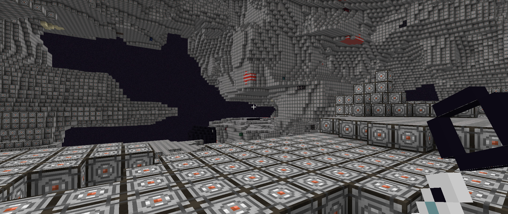

#  Any Dimension Mod 2 Data Pack Expansion



- `Mod:` Applied Energistics 2
- `Expansion Author:` luxmiyu

## Developer Guide

This repo uses blocks from [Applied Energistics 2](https://github.com/AppliedEnergistics/Applied-Energistics-2) as an example data pack expansion for [Any Dimension Mod 2](https://github.com/luxmiyu/adm2). The data pack would be called `Any Dimension Mod 2 Expansion - Applied Energistics 2` in this case.

Follow these instructions you'd like to create your own data pack expansion for Any Dimension Mod 2.

- Open `pack.mcmeta` and edit the fields.
  - Make sure to choose a compatible `"pack_format"` for the Minecraft version you're targetting. See [Pack Format](https://minecraft.wiki/w/Pack_format) for more information.
  - Give it an appropriate `"description"`.
- Open `python/data.json` and edit the fields.
  -  `mod_id`: The mod you intend to create dimensions for.
  -  `block_ids`: The blocks you want to create dimensions for, without their mod id.
- Run `python/start.bat`. You must have Python installed on your machine.

The python scripts will take care of generating all of the important json files for the data pack.

## As a Fabric Mod

You can convert this data pack into a proper Fabric mod by simply including the `data/` folder into the `resources/` folder of your mod project. Take a look at https://fabricmc.net/develop/ if you're unsure where to start!

If you do, please add this entry into your `fabric.mod.json` file to display Any Dimension Mod 2 as
a parent in [ModMenu](https://github.com/TerraformersMC/ModMenu), as well as add it as a dependency.

```js
"depends": {
  // ...
  "adm2": "*"
},
"suggests": {
  "modmenu": "*",
  "immersive_portals": "*"
},
"custom": {
  "modmenu": {
    "parent": "adm2"
  }
}
```

You can view [Any Dimension Mod 2 Expansion - Applied Energistics 2](https://github.com/luxmiyu/adm2-ae2)
as an example of how it could be done!
